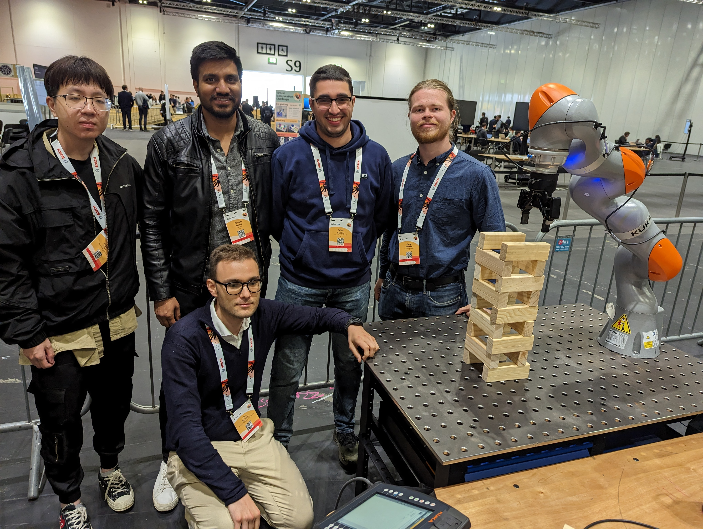

# ICRA 2023 Competition

This repository contains the code and resources used during the the Manufacturing Robotics Challenge at [ICRA 2023](https://www.icra2023.org/).

## Overview

The [Manufacturing Robotics Challenge @ ICRA](https://github.com/gianmarco96/MRC-at-ICRA) focuses on the use of collaborative robots to construct the tallest Jenga tower. Participants are provided with a collaborative robot, a gripper, and a 3D camera. The primary objective is to utilize these tools to build the tallest possible Jenga tower.

 🥈 **2nd Place**: Our team, seen below, manged to secure second palce! 🥈
|Team|
|:--:|
||

:movie_camera: Watch the tower being built [here](https://www.youtube.com/watch?v=4TqlQTydhJ0)! :movie_camera:

### Rules and Assessment

- The main goal is to use the provided collaborative robot to construct the tallest Jenga tower.
- The tower's height will be measured at the end of the challenge, and it must remain standing for at least one minute.
- **Bonus Points**:
  - Teams can earn extra points by using the RGB camera to detect and avoid red pieces (20% added to the final height).
  - Additional points will be awarded if teams can demonstrate the use of the 3D camera to autonomously detect the position and orientation of the bricks (30% added to the final height).
  - Bricks can also be used to create a sculpture. Each tower will receive a sculpture score ranging from 1 to 3. The tower's final height is multiplied by this sculpture score. Scores are determined based on the artistic value and structural integrity of the sculpture.
- Fair play and cooperative conduct are essential throughout the competition. For a detailed breakdown of the rules and expectations, please refer to the [official rules and assessment](https://github.com/gianmarco96/MRC-at-ICRA).

